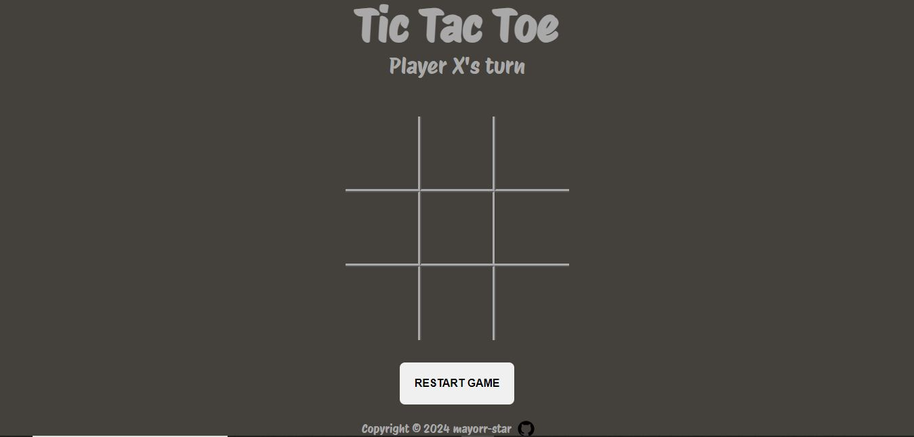

# The Odin Project -Tic Tac Toe

## Table of contents

- [Overview](#overview)
  - [Screenshot](#screenshot)
  - [Links](#links)
- [My process](#my-process)
  - [Built with](#built-with)
  - [What I learned](#what-i-learned)
- [Author](#author)

## Overview

### Screenshot

### Links

- Solution URL: [Add solution URL here](https://your-solution-url.com)
- Live Site URL: [Add live site URL here](https://your-live-site-url.com)

## My process

### Built with

- CSS custom properties
- CSS Grid
- JS factory functions and module patterns

### What I learned

- Using factory functions to create less global code.

## Author

- Twitter - [@yourusername](https://www.twitter.com/yourusername)